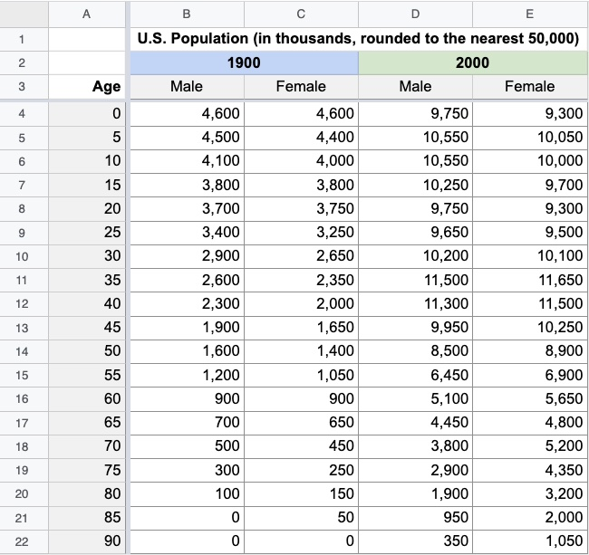

# Assignment: Sketching Visualizations

In this assignment, you will sketch (with pen and paper!) 3 visualizations of a small dataset and provide brief reflections of your designs.

Why sketch? Why not just dive right into coding or using some visualization tool? Sketching is a quick and cheap form of **prototyping** — a process of simulating how a finished product could look and work. Prototyping is a critical part of the design process as it allows us to test the feasibility of our ideas early on. A prototype’s “fidelity” refers to how much it can convey the look of the final product in terms of its level of detail. By moving from low-fidelity prototypes to higher-fidelity ones, we can develop and polish our ideas gradually, focusing on one particular aspect of the product at a time ([Babich, 2017](https://blog.adobe.com/en/publish/2017/11/29/prototyping-difference-low-fidelity-high-fidelity-prototypes-use)).

But prototyping (and sketching, in particular) is also extremely helpful for generating ideas. Rather than grappling with the functionality of any given design tool (which can often influence your design process, even implicitly), or committing to any one specific design, sketching allows us to more rapidly explore the space of possible designs. Research has shown that prototyping several ideas in parallel often leads to better outcomes ([Dow et al., 2011](https://dl.acm.org/doi/abs/10.1145/1978942.1979359)); ([Tohidi et al., 2006](https://dl.acm.org/doi/abs/10.1145/1124772.1124960)).

In this assignment, we are going to gain some practice with sketching visualizations. These sketches will then inform a subsequent assignment. Just like any other activity, sketching can seem intimidating if you have never done it before. So we have compiled some inspiring examples and left you some tips at the end of this page.

The Dataset: U.S. Population, 1900 vs. 2000
Every 10 years, the Census Bureau documents the demographic makeup of the United States, influencing everything from congressional districting to social services. This dataset contains a high-level summary of census data for two years a century apart: 1900 and 2000. The data is a table that describes the U.S. population in terms of the year, reported sex, age group (binned into 5-year segments, from 0-4 years old, 5-9 years old, ..., to 90+ years old), and the total count of people per group. There are 38 data points per year, for a total of 76 data points.

Source: [U.S. Census Bureau via IPUMS](https://www.ipums.org/)

## Your Tasks

* Start by choosing a question about the data you’d like to use a visualization to answer.
* Design three different visualization paper sketches (low-fidelity prototypes) that you believe effectively tackle the question.
* Write one paragraph per sketch about the rationale for your design decisions. What was your motivation behind generating this sketch? What were you hoping it would communicate? What worked well and what didn’t?
* Write one paragraph that reflects on all 3 of your sketches overall. Compare your designs with each other — what are their strengths and weaknesses? What new directions might you explore (e.g., synthesizing elements from every sketch, or describing why one of them is significantly better than the others?).
* Your sketches should be interpretable without consulting your write-ups. Do not forget to include the title, axis labels or legends as needed!

We do not expect your sketches to include every data point, or even accurately represent the data (that’s why we’ve rounded all data values to the nearest 50,000!). The goal of this assignment is to draft different visualization designs. Thus, we do not expect your visualizations to be “perfect,” but rather communicate three ideas that you would plausibly be excited to continue exploring in a subsequent assignment. In fact, we encourage you to use sharpies/markers/felt-tip pens so that your lines are thicker and you are less focused on being “accurate.”

**Note: For this assignment, you should not analyze or visualize the data with software tools. We instead expect you to just look at the dataset and create hand-drawn sketches.**

## Grading

This assignment is scored out of a maximum of 100 points. We will determine scores by judging the diversity of your sketches, the creativity of your ideas, and the crispness of your write-ups.

You can be awarded a maximum of 30 points for each sketch and its related reflection. The remaining 10 points will be awarded for communicating your overall reflection across the 3 sketches (as described above).

## Submission Details

You will follow the submission process and submit your assignment on GitHub:

* Draw your sketches on pen and paper
* Take photos of your sketches
* Compile your sketches and writeups using a quarto document (.qmd) using either R or Python
* Output your work as a single PDF file
* Make sure your images are sized for a reasonable viewing experience — readers should not have to zoom or scroll to effectively view any sketch!

* Add all your requested files to the GitHub assignment repo for the appropriate deliverable.
* Submit a final commit message called **final-submission** to your repo. This is critical so that the instructional team can evaluate your work. Do not change your GitHub repo after submitting the **final-submission** commit message

Make sure you commit only the files requested:
* Use the following naming convention: `l1-[lastname]-[firstname]-wrangling.pdf` with `lastname` and
  `firstname` replaced with your last and first name, respectively.
* `a1-[lastname]-[firstname].qmd`
* `a0-data.png`
* `README.md`
* `imgs/*`

## Tips and Inspiration

* Use a sharpie/marker. Thick lines free you from worrying about the fine-grained details and accuracy of your sketch, and instead focus you on sketching the big picture ideas.
* Similarly, we recommend using pens over pencils — not being able to “undo” your mistakes by erasing them can be remarkably conducive to generating designs.
* You are free to use different colors and any other sketching techniques you can think of (e.g., dotted patterns, cross hatching, etc.).
* You may sketch on touchscreen-enabled devices (e.g., iPads) but we do not recommend them for the same reasons as using pencils — it’s too easy to hit “undo.”
* [How to Sketch, Doodle, and Draw Data Visualization Drafts by Hand](https://depictdatastudio.com/how-to-sketch-doodle-and-draw-data-visualization-drafts-by-hand/)
* [Sketching with Data Opens the Mind’s Eye](https://medium.com/accurat-in-sight/sketching-with-data-opens-the-mind-s-eye-92d78554565)
* For further reading, we recommend [Bill Buxton’s Sketching User Experiences book](https://www.sciencedirect.com/book/9780123740373/sketching-user-experiences) (which builds off the paper linked above).
