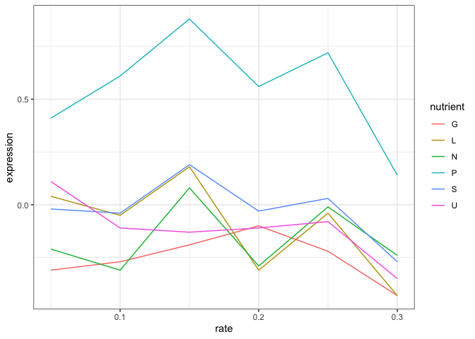
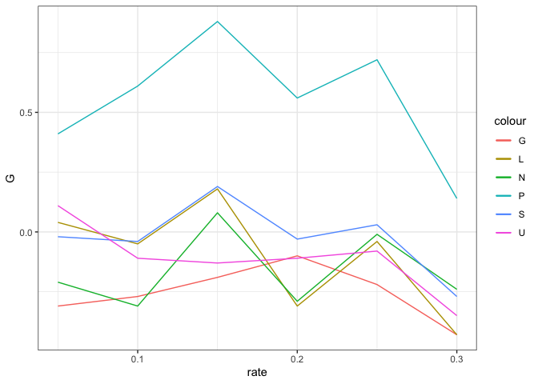
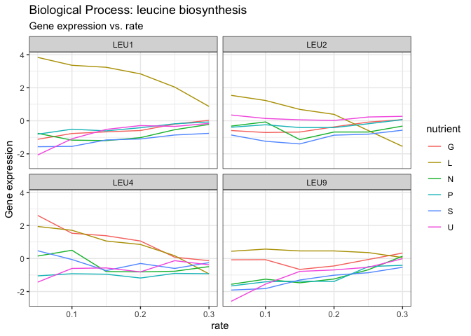

[](https://classroom.github.com/a/6fz2301S)
# Munging for data visualization

# Instructions

This laboratory explores data munging for data visualization and the
utility of tidy data in data visualization toolkits. It will consist of
a demonstration done in class, and an assignment that must be submitted
for grade and completion. All submissions will be via GitHub Classroom.

1.  The assignment portion must be done in a fresh Quarto notebook named
    in the format “l1-\[last name\]-\[first name\]-wrangling.qmd”. You
    may use either R or Python to complete the assignment in this
    notebook.

- If using R, you must use the `ggplot2` package for visualization, and
  the `tidyverse` packages for data munging.
- If using Python, you must use the `matplotlib` and/or `seaborn`
  packages for visualization, and `pandas` for data munging.

2.  The final submission will be denoted by a git commit with the commit
    message `final submission`. This will be what is evaluated for
    grade. This must include:

- The file `l1-[lastname]-[firstname]-wrangling.qmd` with `lastname` and
  `firstname` replaced with your last and first name, respectively.
- `l1-image.png`, created in your Quarto notebook
- `cleaned_data.csv`, which contains the final munged data that is used
  for generating `l1-image.png`. This must be in tidy format.

------------------------------------------------------------------------

# Demonstration

The dataset we will be demostrating today is an extract from a gene
expression dataset generated in a series of yeast experiments
<a href="http://www.molbiolcell.org/content/19/1/352.abstract"
target="_blank">Brauer, 2008</a>, where yeast were starved of certain
nutrients to see how their gene expression changed. Basically, if you
give yeast plenty of nutrients (a rich media), except that you sharply
restrict its supply of one nutrient, you can control the growth rate to
whatever level you desire (we do this with a tool called a chemostat).
For example, you could limit the yeast’s supply of glucose (sugar, which
the cell metabolizes to get energy and carbon), of leucine (an essential
amino acid), or of ammonium (a source of nitrogen).

“Starving” the yeast of these nutrients lets us find genes that:

- **Raise or lower their activity in response to growth rate**.
  Growth-rate dependent expression patterns can tell us a lot about cell
  cycle control, and how the cell responds to stress.
- **Respond differently when different nutrients are being limited**.
  These genes may be involved in the transport or metabolism of those
  nutrients.

This data looks at six nutrients, denoted G, L, N, P, S, and U (think of
these as categories). Under each column is the gene expression for a
particular gene, as the rate at which the yeast was starved changes
(`rate`).

| GID       | rate |     G |     N |    P |     S |     L |     U |
|:----------|-----:|------:|------:|-----:|------:|------:|------:|
| GENE2922X | 0.05 | -0.31 | -0.21 | 0.41 | -0.02 |  0.04 |  0.11 |
| GENE2922X | 0.10 | -0.27 | -0.31 | 0.61 | -0.04 | -0.05 | -0.11 |
| GENE2922X | 0.15 | -0.19 |  0.08 | 0.88 |  0.19 |  0.18 | -0.13 |
| GENE2922X | 0.20 | -0.10 | -0.29 | 0.56 | -0.03 | -0.31 | -0.11 |
| GENE2922X | 0.25 | -0.22 | -0.01 | 0.72 |  0.03 | -0.04 | -0.08 |
| GENE2922X | 0.30 | -0.43 | -0.24 | 0.14 | -0.27 | -0.43 | -0.35 |

What we’d like to see is, for this gene, how the gene expression changes
with the rate. We’d like to see something like this:



To do this, we need to get the data into a tidy format.

Tidy data is defined by

- Each variable forms a column.
- Each observation forms a row.
- Each type of observational unit forms a table.

For any of the toolkits we’ll be using for this lab
(ggplot2/matplotlib/seaborn), we need to get the data into a tidy
format. How do I know this?

- All of them demand that particular columns be used for particular
  things. For example, in ggplot2, the `x` and `y` aesthetics are used
  for the x and y coordinates of the plot.
- This means that values in a column determine those visual attributes
  (we’ll call these visual encodings later).

## Can we do this using non-tidy data?

Sure, we can, but it’s much more painful and doesn’t use the
capabilities or syntactical sugar that is built into the toolkits.

``` r
ggplot(cleaned_data, aes(x = rate)) + 
  geom_line(aes(y = G, color = "G")) + 
  geom_line(aes(y = L, color = "L")) + 
  geom_line(aes(y = N, color = "N")) + 
  geom_line(aes(y = P, color = "P")) + 
  geom_line(aes(y = S, color = "S")) + 
  geom_line(aes(y = U, color = "U")) + 
  theme_bw()
```



## Using tidy data

However, if we munge the data into a tidy format, we can do this much
more easily.

What do we need to do to make this data tidy?

``` r
cleaned_data_munged <- cleaned_data |> 
  pivot_longer(cols = -c(rate, GID), 
    names_to = "nutrient", values_to = "expression")
```

| GID       | rate | nutrient | expression |
|:----------|-----:|:---------|-----------:|
| GENE2922X | 0.05 | G        |      -0.31 |
| GENE2922X | 0.05 | N        |      -0.21 |
| GENE2922X | 0.05 | P        |       0.41 |
| GENE2922X | 0.05 | S        |      -0.02 |
| GENE2922X | 0.05 | L        |       0.04 |
| GENE2922X | 0.05 | U        |       0.11 |
| GENE2922X | 0.10 | G        |      -0.27 |
| GENE2922X | 0.10 | N        |      -0.31 |
| GENE2922X | 0.10 | P        |       0.61 |
| GENE2922X | 0.10 | S        |      -0.04 |
| GENE2922X | 0.10 | L        |      -0.05 |
| GENE2922X | 0.10 | U        |      -0.11 |
| GENE2922X | 0.15 | G        |      -0.19 |
| GENE2922X | 0.15 | N        |       0.08 |
| GENE2922X | 0.15 | P        |       0.88 |
| GENE2922X | 0.15 | S        |       0.19 |
| GENE2922X | 0.15 | L        |       0.18 |
| GENE2922X | 0.15 | U        |      -0.13 |
| GENE2922X | 0.20 | G        |      -0.10 |
| GENE2922X | 0.20 | N        |      -0.29 |
| GENE2922X | 0.20 | P        |       0.56 |
| GENE2922X | 0.20 | S        |      -0.03 |
| GENE2922X | 0.20 | L        |      -0.31 |
| GENE2922X | 0.20 | U        |      -0.11 |
| GENE2922X | 0.25 | G        |      -0.22 |
| GENE2922X | 0.25 | N        |      -0.01 |
| GENE2922X | 0.25 | P        |       0.72 |
| GENE2922X | 0.25 | S        |       0.03 |
| GENE2922X | 0.25 | L        |      -0.04 |
| GENE2922X | 0.25 | U        |      -0.08 |
| GENE2922X | 0.30 | G        |      -0.43 |
| GENE2922X | 0.30 | N        |      -0.24 |
| GENE2922X | 0.30 | P        |       0.14 |
| GENE2922X | 0.30 | S        |      -0.27 |
| GENE2922X | 0.30 | L        |      -0.43 |
| GENE2922X | 0.30 | U        |      -0.35 |

``` r
ggplot(cleaned_data_munged, aes(rate, expression, color = nutrient)) + 
  geom_line() + 
  theme_bw()
```


# Tidy data

## Typical problems to be fixed

- Column headers are values, not variable names.
- Multiple variables are stored in one column.
- Variables are stored in both rows and columns.
- Multiple types of observational units are stored in the same table.
- A single observational unit is stored in multiple tables.

Tidy data is a conceptual framework to structure data in a consistent,
analyses-friendly manner. It helps identify ways in which data are not
tidy.

The crucial question for a particular study is: what is a variable and
what is an observational unit. For example, your data consists of
hospitalizations across a healthcare network.

- If you’re interested in comparing hospitals, the hospital is the
  observational unit.
- If you’re interested in readmissions, then the patient is the unit of
  observation.
- If you’re interested in treatment and care, then the hospital visit is
  the unit of observation

## Tools for tidying data

The main tools you need for tidying data are:

- pivoting (`pivot_longer` and `pivot_wider`, or `melt` and `pivot` in
  `pandas`)
- separating a single column into multiple columns (`separate` in
  `tidyr`, or `str.split` in `pandas`)
- combining multiple columns into a single column (`unite` in `tidyr`,
  or `str.join` in `pandas`)
- split-apply-combine (`group_by` and `summarize` in `dplyr`, or
  `groupby` and `agg` in `pandas`)

You really need to know these tools **really well** in order to do data
science proficiently.

------------------------------------------------------------------------

# The Assignment

There is a file in the `data` directory called `raw.csv`. This is the
full dataset from which the demonstration is derived, and comprises the
same sort of data for multiple genes. It includes metadata about the
genes, stored in the `NAME` column. Data in this column is of the format

    <gene name > || <biological process> || <molecular function> || <systematic
    name>

## Tasks

1.  Munge the data into a tidy format and save it as `cleaned_data.csv`.
    This will involve:

- Separating the `NAME` column into multiple columns (named `gene_name`,
  `biological_process`, `molecular_function`, and `systematic_name`).
- Pivoting the data so that the column names `G`, `L`, `N`, `P`, `S`,
  and `U` are in a single column, and the values are in another column
  (`expression`).

2.  Create the following visualization and save it as `l1-image.png`.

- If you’re doing this in Python, I strongly suggest using `seaborn` for
  this. You may get slightly different names for the panels, but that
  will be alright


